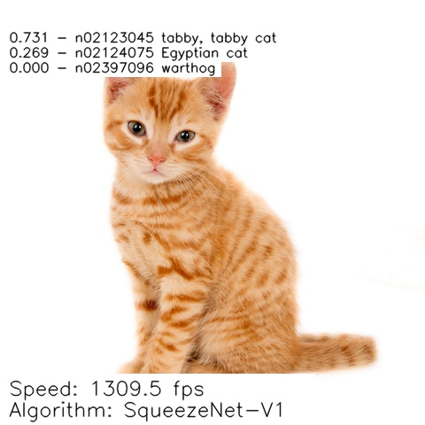
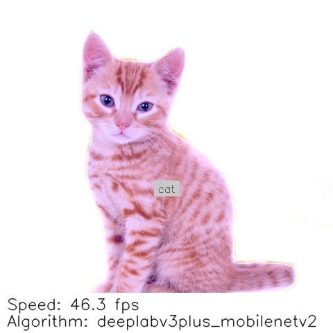

# Kalray Neural Network Models

</a> 

 

The KaNN™ Model Zoo repository provides a list of neural networks models __ready to compile & run__ on MPPA®
manycore processor. This comes on top of KaNN™ tool for model generation and enhance __AI solutions__ onto Kalray
processor.

## SDK Kalray Neural Network (KaNN)

Kalray Neural Network (KaNN) is a SDK included in AccessCore Embedded (ACE) compute offer to optimize AI inference
on our dedicated processor called MPPA® (last generation, the 3rd, is named Coolidge 2). It is composed by:

* __generator__ : a python wheel to parse, optimize and paralellize an intermediate representation of a neural
  networks. Thanks to the runtime, it gives you then the opportunity to run the algorithm directly on the MPPA®
* __runtime__ : optimized libraries (in ASM/C/C++) to execute each operation nodes.

ACE 5.4.0 (KaNN) supports: Tensorflow, TFlite, ONNX and Pytorch/ONNX.

## Contents

To quickly deploy a neural network on the MPPA®, a WIKI note is available [here](WIKI.md):
* [Kalray neural networks (KaNN) framework description](./WIKI.md#kalray-neural-networks-kann-framework-description)
* [Pre-requisites: SW environment \& configuration](./WIKI.md#pre-requisites-sw-environment--configuration)
* [How models are packaged](./WIKI.md#how-models-are-packaged)
* [Generate a model to run on the processor (MPPA®)](./WIKI.md#generate-a-model-to-run-on-the-processor-mppa)
* [Evaluate the neural network inference on the MPPA®](./WIKI.md#evaluate-the-neural-network-inference-on-the-mppa)
* [Run neural network as a demo](./WIKI.md#run-neural-network-as-a-demo)
* [Custom Layers for extended neural networks](./WIKI.md#custom-layers-for-extended-neural-networks)
* [Jupyter Notebooks](./WIKI.md#jupyter-notebooks)

CNN Models are divided into 3 types of Machine Vision applications:
* [classification](./networks/classifiers/README.md)
* [object-detection](./networks/object-detection/README.md)
* [segmentation](./networks/segmentation/README.md)

The examples below illustrates the kind of predictions you must have:

| Classification (SqueezeNet)                                              | Object-detection (Yolov8n)                                                | Segmentation (Deeplabv3+)                                               |
|--------------------------------------------------------------------------|---------------------------------------------------------------------------|-------------------------------------------------------------------------|
| </a> | </a> | </a> |

*images has been realized using model from this repository and KaNN™ SDK solution (ACE-5.4.0)

## List of Neural Networks

All networks are proposed into selected Neural Network architectures, such as:

__Classifiers__ : complete list can be found [here](./networks/classifiers/README.md)

* DenseNet
* EfficientNet
* Inception
* ResNet
* RegNet
* MobileNet
* NasNet
* SqueezeNet
* VGG

__Object-detection__ : complete list can be found [here](./networks/object-detection/README.md)

* EfficientDet
* Faster-RCNN
* FCN
* RetinatNet
* SSD
* YOLO

__Segmentation__ : complete list can be found [here](./networks/segmentation/README.md)

* DeeplabV3+
* Mask-RCNN
* UNet
* YOLO

## Notes

* Since ACE 5.4.0, the extension file of the serialized binary file (serialized_params_<my_network>.bin)
  generated by kann is now renamed to <my_network>.kann file. The use of the file is exactly the same
  in ACE 5.3.0 (and older version). Please refer to ACE's README documentation.
* Tensorflow and Tensorflow-lite will be deprecated in the next ACE version. All TF networks of the repository
  would be converted in ONNX.

## Requirements

### Hardware requirements
Host machine(s):
* x86_64 CPU
* DDR RAM 8Go min
* HDD disk 32 Go min
* PCIe Gen3 min, Gen4 recommended

Acceleration card(s):
* 
* 

### Software requirements
* 
  
* 
* 
  
