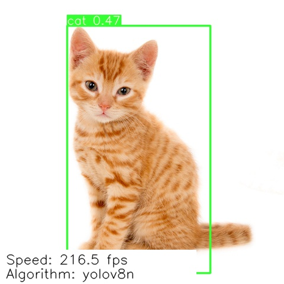

# Kalray Neural Network Models

</a> 

 

The repository purposes neural networks models __ready to compile & run__ on MPPA®.

The KaNN™ Model Zoo repository provides a list of neural networks models __ready to compile & run__ on MPPA®
manycore processor. This comes on top of KaNN™ tool for model generation and enhance __AI solutions__ onto Kalray
processor.

## Contents

To quickly deploy a neural network on the MPPA®, a WIKI note is available [here](WIKI.md):
* [Kalray neural networks (KaNN) framework description](WIKI.md#kalray-neural-networks-kann-framework-description)
* [Pre-requisites: configure the SW environment](WIKI.md#pre-requisites-configure-the-sw-environment)
* [How models are packaged](WIKI.md#how-models-are-packaged)
* [Generate a model to run on the processor (MPPA®)](WIKI.md#generate-a-model-to-run-on-the-processor-mppa)
* [Evaluate the neural network inference on the MPPA®](WIKI.md#evaluate-the-neural-network-inference-on-the-mppa)
* [Run neural network as a demo](WIKI.md#run-neural-network-as-a-demo)
* [Custom Layers for extended neural networks](WIKI.md#custom-layers-for-extended-neural-networks)

CNN Models are divided into 3 types of Machine Vision applications:
- [classification](./networks/classifiers/README.md)
- [object-detection](./networks/object-detection/README.md)
- [segmentation](./networks/segmentation/README.md)

The examples below illustrates the kind of predictions you must have:

| Classification (Regnet-x-1.6g)                                           | Object-detection (Yolov8n)                                                | Segmentation (Deeplabv3+)                                               |
|--------------------------------------------------------------------------|---------------------------------------------------------------------------|-------------------------------------------------------------------------|
| </a> | </a> | </a> |

*images has been realized with the model of this repository and KaNN™ SDK solution 

## List of Neural Networks 

All networks are proposed into selected Neural Network architectures, such as:

#### __Classifiers__ : complete list can be found here: [link](./networks/classifiers/README.md)
* DenseNet
* EfficientNet
* Inception
* ResNet
* RegNet
* MobileNet
* NasNet
* SqueezeNet
* VGG

#### __Object-detection__ : complete list can be found here: [link](./networks/object-detection/README.md)
* EfficientDet
* Faster-RCNN
* FCN
* RetinatNet
* SSD
* YOLO

#### __Segmentation__ : complete list can be found here: [link](./networks/segmentation/README.md)
* DeeplabV3+
* Mask-RCNN
* UNet2D
* YOLOv8-seg

## Requirements
### Hardware requirements
Host machine(s):
  - x86_64 CPU
  - DDR RAM 8Go min
  - HDD disk 32 Go min
  - PCIe Gen3 minimum

Acceleration card(s):
  - 
  - 

### Software requirements
* 
  
* 
* 

