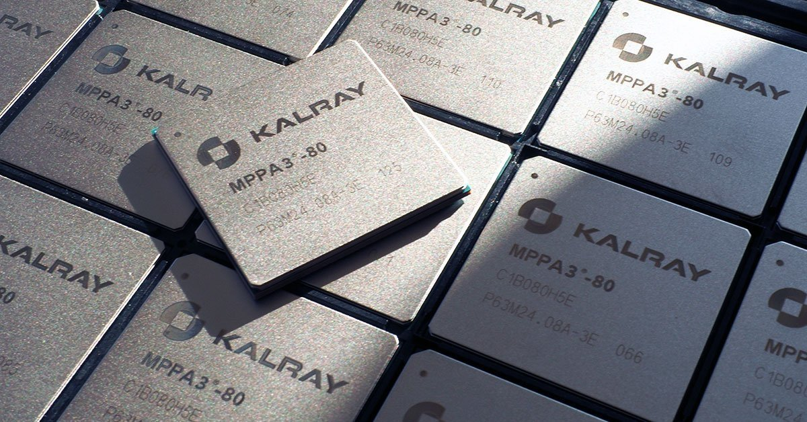
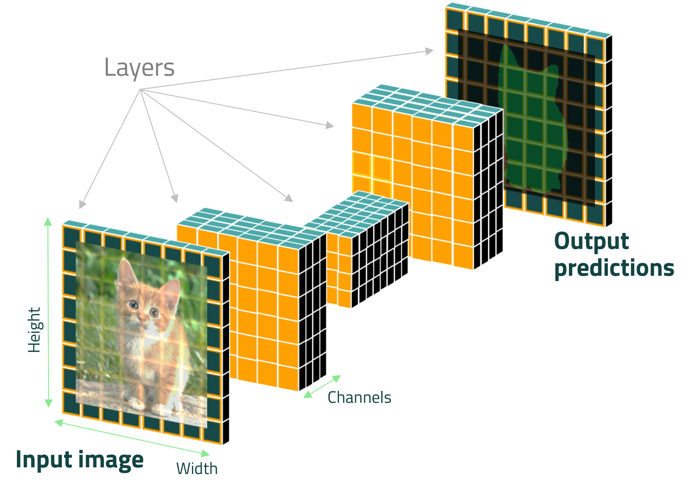

# WIKI - Kalray Neural Network Models Zoo

</a></br>


</br>

The KaNN™ Model Zoo repository provides a list of neural networks models __ready to compile & run__ on MPPA®
manycore processor. This comes on top of KaNN™ tool for model generation and enhance __AI solutions__ onto Kalray
processor.


## Table of contents

- [WIKI - Kalray Neural Network Models Zoo](#wiki---kalray-neural-network-models-zoo)
  - [Table of contents](#table-of-contents)
  - [Kalray neural networks (KaNN) framework description](#kalray-neural-networks-kann-framework-description)
  - [Pre-requisites: SW environment \& configuration](#pre-requisites-sw-environment--configuration)
  - [How models are packaged](#how-models-are-packaged)
  - [Generate a model to run on the MPPA®](#generate-a-model-to-run-on-the-mppa)
  - [Evaluate the neural network inference on the MPPA®](#evaluate-the-neural-network-inference-on-the-mppa)
  - [Run neural network as a demo](#run-neural-network-as-a-demo)
  - [Custom Layers for extended neural networks](#custom-layers-for-extended-neural-networks)
  - [Jupyter Notebooks](#jupyter-notebooks)


## Kalray neural networks (KaNN) framework description

</a></br>

KaNN is a Kalray software purpose, available in the SDK AccessCore Embedded (ACE) offer. It
 leverages the possibility to parse and analyze a Convolution Neural Network (figure above)
 from different SW environments such as ONNX, Tensorflow, TFlite, PyTorch; and generate a
 MPPA code to achieve the best performance efficiency. This repository does not contain any
 information about the use of the API, but it helps to deploy AI solutions. For details,
 please do not hesitate to read the documentation 😏 or contact us directly.

So, to deploy your solution from an identified neural networks, the steps are all easy 😃 :
1. From a CNN, generate a model (no HW dependencies)
2. Run model from demo application (python + cpp host application, included in the repository
   and ACE software)


## Pre-requisites: SW environment & configuration

Source the Kalray's AccessCore® environment, at the following location:
```bash
 source /opt/kalray/accesscore/kalray.sh
 ```
and check the envrionment variable `$KALRAY_TOOLCHAIN_DIR` is not empty.

If it does not exist, please configure a specific virtual python environment (recommended):
```bash
export KANN_ENV=$HOME/.local/share/python3-kann-venv
python3 -m venv $KANN_ENV
```
Source your python environment:
```bash 
source $KANN_ENV/bin/activate
```

Install local KaNN wheel and all dependencies (it supposed the ACE Release is installed in `$HOME` directory):
```bash
pip install $HOME/ACE5.4.0/KaNN-generator/kann-5.4.0-py3*.whl
```

Finally, do the same for the python requirements of the repo:
```bash 
pip install -r requirements.txt --extra-index-url https://download.pytorch.org/whl/cpu
```
Please see kalray install procedure detailed at:
[link](https://lounge.kalrayinc.com/hc/en-us/articles/)

Source your python environment:
```bash 
source $KANN_ENV/bin/activate
```

## How models are packaged

Each model is packaged to be compiled and run for KaNN SDK. It is one DIRectory, where you could find:
- a pre-processing python script: `input_preparator.py`
- a post-processing directory: `output_preparator/`
- a model dir: with model file (*.pb, *.onnx, *.tflite) depending of its implementation
- configuration files (*.yaml) for generation:
    * network_f16.yaml :  batch 1 - FP16 - nominal performance
    * network_i8.yaml :   batch 1 - FP16/Q-INT8 - nominal performance

Models LICENSE and SOURCES are described individually in our HuggingFace space, available at:
https://huggingface.co/Kalray


## Generate a model to run on the MPPA®

Use the following command to generate an model to run on the MPPA®:
```bash
# $ ./generate <configuration_file.yaml> -d <generated_path_dir>
./generate networks/object-detection/yolov8n-relu/onnx/network_f16.yaml -d yolov8n
```

It will provide you into the path directory `generated_path_dir`, here called "yolov8n":
* a <my_network>.kann file (network contents with runtime and context information)
* a network.dump.yaml file (a copy of the configuration file used)
* a log file of the generation

Please refer to Kalray documentation and KaNN user manual provided for more details !


## Evaluate the neural network inference on the MPPA®

Kalray's toolchain integrates its own host application named `kann_opencl_cnn` to run compiled model.
it will be called using the `./run` script to evaluate the performance of the Neural Network
on the MPPA®.

Use the following command to start quickly the inference:
```bash
# $ ./run infer <generated_path_dir>
./run infer yolov8n
```

Use the following command to start quickly the inference on 25 frames:
```bash
# $ ./run infer <generated_path_dir> --nb-frames=25
./run infer yolov8n -n 25
```

Use the following command to get more details on options:
```bash
$ ./run --help        # for general options
# or
$ ./run infer --help  # for infer subcommand options
# or
$ ./run demo --help  # for infer subcommand options
```

## Run neural network as a demo

Use the following command to start quickly the inference of the model just
generated into a video pipeline. It will include the inference into a pre-
and post-processing scripts with a video/image stream input, supported by
OpenCV python api.

```bash
# $ ./run demo <generated_path_dir> <source_file_path>
./run demo yolov8n ./utils/sources/cat.jpg
```

All timings are logged by the video demo script, and reported such as:
+ read : time to import frame
+ pre  : pre processing time
+ send : copy data to FIFO in
+ kann : wait until the FIFO out is filled (including the neural network inference)
+ post : post processing time
+ draw : draw annotation on input frame
+ show : time to display the image though opencv
+ total: sum of the previous timings

To disable the L2 cache at runtime (now implicit, a message will warn you):
```bash
./run --l2-off demo yolov8n ./utils/sources/dog.jpg
```

To disable the display:
```bash
./run demo yolov8n ./utils/sources/street/street_0.jpg --no-display
```

To disable the replay (for a video or a image):
```bash
$ ./run demo yolov8n ./utils/sources/street/street_0.jpg --no-replay
```

Save the last frame annotated into the current dir:
```bash
$ ./run demo yolov8n ./utils/sources/street/street_0.jpg --no-replay --save-img --verbose
```

To run on the CPU target (in order to compare results):
```bash
$ ./run demo --device=cpu yolov8n ./utils/sources/street/street_0.jpg --no-replay --save-img --verbose
```

Demonstration scripts are based on python API, host application does not use pipelining for example.
The video pipeline is not FULLY OPTIMIZED and requires custom developments to benefit of the full
performance of the MPPA®, depending of your own environment and system. Do not hesitate to contact
our services <support@kalrayinc.com> to optimize your solution.

Please take a look to our notebooks included in the repository (see [Jupyter Notebooks](#jupyter-notebooks))


## Custom Layers for extended neural networks

According to the Kalray's documentation in KaNN manual, users have the possibility to integrate
custom layers in case of layer are not supported by KaNN. So, follow those steps (more details
in KaNN user manual):
1. Implement the python function callback to ensure that KaNN generator is able to support the Layer
2. Implement the layer python class to ensure that arguments are matching with the C function
3. Implement C function into the SimpleMapping macro, provided in the example.
4. Build C function with Kalray makefile and reuse it for inference

To ensure to use all extended neural networks provided in the repository, such as YOLOv8 for
example the DIR `kann_custom_layers` contents the support of :
 * SiLU

Please find the few steps to use it, for example YOLOv8:
1. Configure sw environment
```bash
$ source /opt/kalray/accesscore/kalray.sh
```

Considering that python environment is set to : `$HOME/.local/share/python3-kann-venv`
```bash
# (kvxtools)
source $HOME/.local/share/python3-kann-venv/bin/activate
```

2. Then, buid custom kernels to run over the MPPA®:
```bash
make -BC kann_custom_layers O=$PWD/output
```

2. Generate model:
```bash
PYTHONPATH=$PWD/kann_custom_layers ./generate $PWD/networks/object-detection/yolov8n/onnx/network_best.yaml -d yolov8n
```

3. Run demo with generated DIR and new kernels compiled (.pocl file) for the MPPA®
```bash
./run --pocl-dir=$PWD/output/opencl_kernels demo --device=mppa yolov8n ./utils/sources/cat.jpg --verbose
```
or on the cpu directly:
```bash
./run demo --device=cpu yolov8n ./utils/sources/cat.jpg --verbose
```

## Jupyter Notebooks

You could notice that a DIR called `./notebooks/` is available in this repository. Take a look to:
* [x] [quick start](./notebooks/quick_start.ipynb): generate and run quickly a neural networks from
   the kann-models-zoo

To execute it, please set up your python environment and be sure you could use correctly your preferred web browser
(firefox, google-chrome, ... for example) :

```bash
# source YOUR python environment if not done
source $KANN_ENV/bin/activate
# install jupyter notebook package
pip install jupyter
# wait that all dependencies are installed ...
```

From kann-models-zoo home directory, then open the desired notebook:
```bash
jupyter notebook notebooks/quick_start.ipynb &
```

A new window would appear such as below:

</a></br>

Finally, select & click to `Run` > `Run All Cells (Shift+Enter)` to execute all commands-in-line ...
et voilà 😃. Do not forget restart the kernel if needed and to kill the jupyter notebook server once
terminated.

Other notebooks will be soon available:
* [ ] advanced : import a neural network and create a package to run on the MPPA
* [ ] graph inspection: analyze a neural network generated by kann
* [ ] fine-tune: optimize the generation of a neural network
* [ ] custom layer (basic) : use the custom layer already implemented in this repository
* [ ] custom layer (advanced): implement a custom layer to support a specific network
* [ ] custom kernel (advanced): implement a custom kernel to support a specific network
* [ ] custom kernel (expert): optimie a custom kernel to accelerate a specific network

Authors: Quentin Muller <qmuller@kalrayinc.com>

