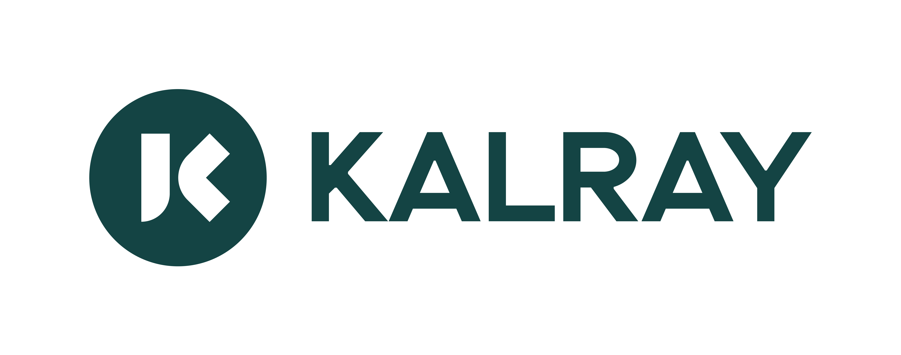

</a>

## List of Segmentation neural networks
This repository gives access to following segmentation Neural Networks main architecture:
* DeeplabV3+
* Fully Convolution Network (FCN)
* U-Net
* YOLO

Please find the complete list here:  

<!-- START AUTOMATED TABLE -->
| NAME                                                      |   FLOPs | Params | mAP-50/95 |  mIoU  | Framework |  Input  | Dataset       | ACE status                                            |
|:----------------------------------------------------------|--------:|-------:|:---------:|:------:|:----------|:-------:|:--------------|:------------------------------------------------------|
| [DeeplabV3Plus-mobilenet-V2](./deeplabv3plus-mobilenetv2) |  17.4 G |  2.0 M |           |   -    | tf1       | 512x512 | VOC-COCO 2017 |    |
| [DeeplabV3Plus-Resnet50](./deeplabv3plus-resnet50)        |  65.3 G | 12.0 M |           |   -    | tf1       | 416x416 | COCO 2014     |    |
| [FCN-Resnet50](./fcn_resnet50)                            | 276.9 G | 32.9 M |           | 60.5 % | onnx      | 512x512 | VOC-COCO 2017 |    |
| [FCN-Resnet101](./fcn_resnet101)                          | 432.2 G | 51.8 M |           | 63.7 % | onnx      | 512x512 | VOC-COCO 2017 |    |
| [UNet-2D-medical](./unet2d-tiny-med)                      |  24.4 G |  7.7 M |           |   -    | onnx      | 256x256 | MRI-BRAIN     |    |
| [UNet-2D-indus](./unet2d-tiny-ind)                        |  36.7 G | 1.85 M |           |   -    | tf1       | 512x512 | DAGM-2007     |    |
| [YOLOv8n-seg](./yolov8n-seg)                              |  12.2 G |  3.4 M |   30.5    |        | onnx      | 640x640 | COCO 2017     |    |
| [YOLOv8m-seg](./yolov8m-seg)                              | 105.2 G | 27.2 M |   40.8    |        | onnx      | 640x640 | COCO 2017     |    |
<!-- END AUTOMATED TABLE -->

 means that you have to use Custom layer
feature to run the model (and would be integrated in next ACE release).

Please see WIKI.md to use it.
